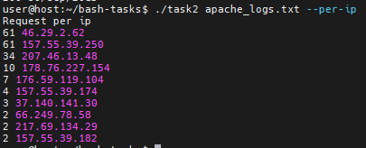

A. Create a script that uses the following keys: 
1. When starting without parameters, it will display a list of possible keys and their description. 
2. The --all key displays the IP addresses and symbolic names of all hosts in the current subnet 
3. The --target key displays a list of open system TCP ports. The code that performs the functionality of each of the subtasks must be placed in a separate function 


B. Using Apache log example create a script to answer the following questions: 
1. From which ip were the most requests? 
2. What is the most requested page?
3. How many requests were there from each ip? 
4. What non-existent pages were clients referred to? 
5. What time did site get the most requests? 
6. What search bots have accessed the site? (UA + IP) 





1. From which ip were the most requests? 
```
61 46.29.2.62
```
3. What is the most requested page?
```
 190 /wp-content/uploads/2014/11/favicon.ico
```
5. How many requests were there from each ip? 
```
61 46.29.2.62
61 157.55.39.250
34 207.46.13.48
10 178.76.227.154
7 176.59.119.104
4 157.55.39.174
3 37.140.141.30
2 66.249.78.58
2 217.69.134.29
2 157.55.39.182
```
7. What non-existent pages were clients referred to? 
```
Non existen pages
      1 /apple-touch-icon.png
      1 /apple-touch-icon-precomposed.png
      1 /backup/info.php
      1 /ehsteticheskaya-medicina/injekcii/biorevitalizaciya/preparaty-dlya-biorevitalizacii.html/register.aspx
      1 /ehsteticheskaya-medicina/injekcii/biorevitalizaciya/register.aspx
      1 /ehsteticheskaya-medicina/injekcii/register.aspx
      1 /ehsteticheskaya-medicina/register.aspx
      1 /google89150ef520da50eb.html
      1 /otzivi-obzori/yuviderm-otzivi-obzori/yuviderm-ne-ochen-dovolna-22-goda.html
      1 /register.aspx
      1 /rtc_wizard_index.htm
      1 /sxd/info.php
      1 /ukhod-z
      1 /ukhod-za-soboj/pokhudenie/dieti/dieta-grechnevaya-s-kefirom.html%D1%87%D0%B8%D1%82%D0%B0%D0%B9
      1 /ukhod-za-soboj/pokhudenie/dieti/map.css
      1 /wp-content/plugins/stats-counter/img/icon.png
      1 /wp-content/themes/cassia/css/fonts/flexslider-icon.svg
      1 /wp-content/themes/cassia/css/fonts/flexslider-icon.ttf
      1 /wp-content/themes/cassia/css/fonts/flexslider-icon.woff
      2 /
      2 /.bash_history
      2 /.bzr/branch-format
      2 /.git/config
      2 /.hg/hgrc
      2 /LISU.ttf
      2 /LISU.woff
      2 /.svn/format
      2 /.svn/wc.db
     10 /wp-content/themes/cassia/css/fonts/flexslider-icon.eot?

```
9. What time did site get the most requests? 
```
Request per day
200 30/Sep/2015
```
11. What search bots have accessed the site? (UA + IP) 

C. Create a data backup script that takes the following data as parameters: 


1. Path to the syncing directory. 
2. The path to the directory where the copies of the files will be stored. In case of adding new or deleting old files, the script must add a corresponding entry to the log file indicating the time, type of operation and file name. [The command to run the script must be added to crontab with a run frequency of one minute]


