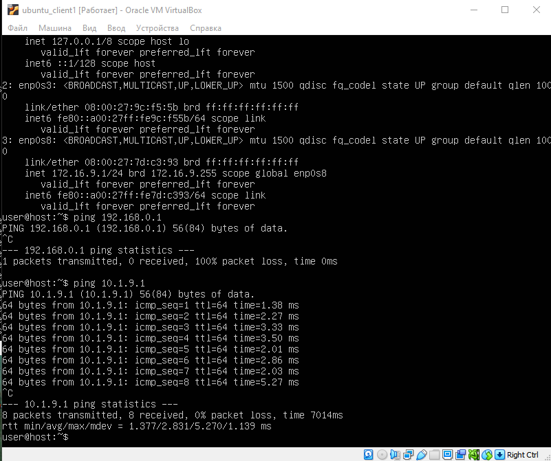

# Set up three servers for this laboratory.

1. ubuntu_client1 - Internal network
2. ubuntu_client2 - Internal network
3. ubuntu_srv1 - NAT


IP for all network

For network №2:
```
net2 = 10.1.9.0/24
int1 = 10.1.9.2/24
int2 = 10.1.9.1/24
```

For network №3:
```
net3 = 10.9.9.0/24
int3 = 10.9.9.1/24
int1 = 10.9.9.2/24
```

For network №4:
```
net4 = 172.16.9.0/24
int2 (client 1) = 172.16.9.1/24
int2 (client 2) = 172.16.9.2/24
```

For network №1:
```
net1 = 192.168.0.0/24
gateway (host) = 192.168.0.1/24
```

First of all let's set up  network for "net4", so we can ping from client_1 to client_2. I used two ubuntu server 22.04 LTS version, so i will make changes with netplan.


## Configure static ips for server_1

For server_1 we need configure two static ips for net2 and net3. It will be int2 and int3 interfaces.

Before launch server_1, in VM Box i apply three adapters NAT and two Internal network.


So i am using ubuntu 22.04 LTS fore all hosts, and way to set up network it's netplan, that can be found in ```/etc/netplan/*.yml``` path.

```yml
network:
	ethernets:
		enp0s3:
			dhcp4: true
		enp0s8:
			addresses: [10.1.9.1/24]
		enp0s9:
			addresses: [10.9.9.1/24]
	version:2
```

Back to console and apply those setting with command 
``` 
sudo netplan apply
```
Result ```ip a```


## Set up dhcp server for server_1 to provide ips for clients.

```
sudo apt install isc-dhcp-server
```
Go to file ```/etc/default/isc-dhcp-server```
- uncomment line with  ```DHCPDv4_CONF=/etc/dhcp/dhcpd.conf```
- Add interafces ```INTERFACESv4="enp0s8 enp0s9"```

Go to file ``` sudo nano /etc/dhcp/dhcpd.conf```

Uncomment and add new subnet section
```
subnet 10.1.9.0 netmask 255.255.255.0 {
	option routers 192.168.0.1;
	option domain-name-servers 8.8.8.8, 8.8.4.4;
	option domain-name "test.ooo";
	range 10.1.9.9.10 10.1.9.200;
	option broadcast-address 10.1.9.255;
	option subnet-mask 255.255.255.0;
	default-lease-time 600;
	max-lease-time 7200;
}
```

```
subnet 10.9.9.0 netmask 255.255.255.0 {
	subnet 10.9.9.0 netmask 255.255.255.0 
	option routers 192.168.0.1;
	option domain-name-servers 8.8.8.8, 8.8.4.4;
	option domain-name "test.ooo";
	range 10.9.9.9.10 10.9.9.200;
	option broadcast-address 10.9.9.255;
	option subnet-mask 255.255.255.0;
	default-lease-time 600;
	max-lease-time 7200;
}
```

Add interface for listen DHCP in  ```/etc/default/isc-dhcp-server```
in line ```INTERFACESv4 = "enp0s8 enp0s9"```

-  enp0s8 - interface that listen net2;
-  enp0s9 - interafce that listen net3;

Run command ```sudo service isc-dhcp-server start``` to run DHCP server. 

Check status DHCP server run ``` sudo systemctl status isc-dhcp-server ```. If everything fine with config you will get next message


## Asign ip addreses for clients

To asign ip address for client in VMbox, need setup network

For client 1 it will be net2


For client 2 it will be net3
![[dlient2_setup.png]]

Run client 1 and open ```/etc/netplan/*.yml``` file, change enp0s3:
```yml
network:
	ethernets:
		enp0s3:
			dhcp4: true
		enp0s8:
			addresses: [172.16.9.1/24]
	version:2
```

Apply changes and run ```sudo netplan apply``` then reboot or restart net service.

Result for clinet 1


Use same setting for clinet 2 (IP enp0s8 interface willl be 172.16.9.2/24)

Result for client 2:


Ping test for client1:


Ping test for client2:


