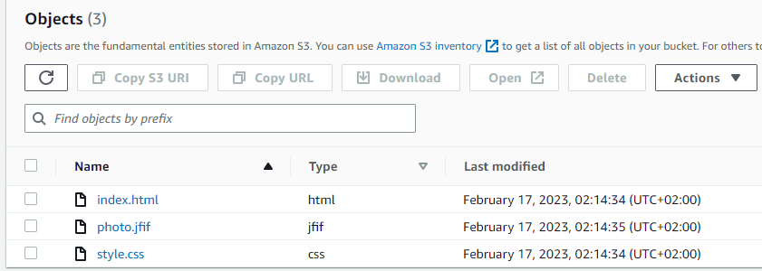

1. Read the terms of Using the AWS Free Tier and the ability to control their own costs. 
2. Register with AWS (first priority) or alternatively, you can request access to courses in AWS Academy if you are currently a student of certain University. 
3. Find the hands-on tutorials and AWS Well-Architected Labs for your AWS needs. Explore list of step-by-step tutorials for deferent category. Use, repeat as many as you can and have fun)) 
4. Register and pass courses on AWS Educate. Filter by checking Topic Cloud Computing and Foundational Level. Feel free to pass more. 
5. Register and pass free courses on AWS Skillbuilder. AWS Cloud Practitioner Essentials: Core Services, AWS Cloud Practitioner Essentials: Cloud Concepts. Try AWS Cloud Quest: Cloud Practitioner
6. Pass free courses on Amazon qwiklabs 
7. Review Getting Started with Amazon EC2. Log Into Your AWS Account, Launch, Configure, Connect and Terminate Your Instance. Do not use Amazon Lightsail. It is recommended to use the t2 or t3.micro instance and the CentOS operating system. 
   
Run instance with next configuration

Create key pair to be able to connect to server 

Allow SSH connection

After launched instance: 

Server has many parameters, but for SSH connect we need IP

For Amazon AMI wich use CentOS username is `ec2-user`. Put in IP, specify key for connection.

Result is successful connection:

Termination instance:

8. Create a snapshot of your instance to keep as a backup. 

Create another server:

In storage parameters it has ID: 

Go to EBS section `Snapshots`

Use `Create snapshot`, choose `Resource type - Instance`, choose Volume ID:  

`Create snapshot` button and result:

9. Create and attach a Disk_D (EBS) to your instance to add more storage space. Create and save some file on Disk_D. 

Go to `Volumes` in EBS section and `create volume`

Result after apply:

Attache to EC2:

Storage parameter for server:

Go in server and add new files:

11. Review the 10-minute example. Explore the possibilities of creating your own domain and domain name for your site. Note, that Route 53 not free service. Alternatively you can free register the domain name *.PP.UA and use it. 

Registered domain name on nic.ua with yegor-sidenko.pp.ua 

Write html code and test it on localhost:

Register hosted zone for domain name 

12. Create a static website on Amazon S3, publicly available (link1 or link2 - using a custom domain registered with Route 53). Post on the page your own photo, the name of the educational program (EPAM Cloud&DevOps Fundamentals Autumn 2022), the list of AWS services with which the student worked within the educational program or earlier and the full list with links of completed labs (based on tutorials or qwiklabs). Provide the link to the website in your report and СV.

Create bucked s3 for static web page:

Allow public access

Go to bucket properties and enable "static website hosting"

Add rule to bucket to make it public

Push html files to bucket

Now, we can access website via S3 Bucket link 

To attach DNS to S3 we need to go Hosted zone and add  record

Now we need set up NS that can be found in Hosted zone 

Choose NS-servers "Custom servers" and paste in 

So now we can access to website via domain name "yegor-sidenko.pp.ua"

